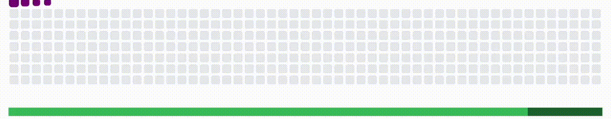

<!--HEADER-->

<!--INTRO-->

<h3 align="center">
    
    
    

</h3>

<!--[//]: # ([![Twitter]&#40;https://img.shields.io/badge/Twitter-%231DA1F2.svg?style=for-the-badge&logo=Twitter&logoColor=white&#41;]&#40;https://facebook.com/varskann&#41;)-->

<!--profile counter-->
<!--

 
  Visitor count 
  

-->

🐉 Dragon tamer of pixels, crafting future-seeing visions with code and fire

Devouring knowledge, cooking Michelin-star magic in code and cuisine 🧑🏻‍🍳

👨🏻‍💻 Geeking out on algorithms and pixelated mayhem, conquering frontiers together

🧗 Curiosity sketches landscapes, wanderlust paints adventures 👨🏻‍🎨

🐼 Whipping up a villain wallop... 

<!--GITHUB SUMMARY-->

<!--SKILLS-->

<h3 align="center">
    
    
    

        
        Arcane Arsenal
        
    
  
</h3>

[//]: # (<a href="https://github.com/varskann">)

[//]: # ()

[//]: # (</a>)
<!--
<table><tr>

  
  
  
  
  
  
  
  
  
  
  
  
  
  
  
  

-->

| **Coding**                                                                      | **AI/ML**                                                                       | **Frameworks**                                                                  |  
|---------------------------------------------------------------------------------|---------------------------------------------------------------------------------|---------------------------------------------------------------------------------|
| 

   | 

 | 

         |
| 

     | 

   | 

   | 
| 

         | 

   | 

   | 
| 

     | 

   | 

  | 
| 

 | 

     | 

 |
| 

     |                                                                                 | 

     |

<!--GITHUB DETAILS-->
<h3 align="center">
     
     
    

        
        Gritty Stats
    
 

</h3>

 

2023 Unwrapped

[//]: # (![Kanishk's 2023 Unwrapped]&#40;./assets/github-unwrapped.gif&#41;)

<!--GITHUB STATS-->

📈...Superpower Surge(Github Summary)

 

    

 

 

    
<a href="https://user-badge.committers.top/india/varskann">

</a>

 

[//]: # (<!--SNAKE-->)

[//]: # (
)

[//]: # (<a href="https://github.com/varskann">)

[//]: # (   )

[//]: # (</a>)

[//]: # (
)

<!--REPOSITORIES-->

   

📁Project safari

      

 
 

<!--BLOGS-->
<h3 align="center">
     
     
    

        Quantum Leaps
        
    
 

</h3>

[//]: # (## 🔔 𝙼𝚢 𝙻𝚊𝚝𝚎𝚜𝚝 𝙶𝚒𝚝𝙷𝚞𝚋 𝙼𝚎𝚝𝚛𝚒𝚌𝚜)

[//]: # (![Metrics]&#40;https://metrics.lecoq.io/varskann&#41;)

[//]: # ()

Wit-Fu Master

<!--

-->

Wield the Ink-Scepter!

<!-- BLOG-POST-LIST:START -->
[Python Is Fun: Tricks of the Trade](https://kanishkvarshney.medium.com/fun-with-python-88d599ac07e1?source=rss-f03eab685dc5------2) 
[Python Documentation: Generating HTML using Sphinx](https://kanishkvarshney.medium.com/python-documentation-generating-html-using-sphinx-a0d909f5e963?source=rss-f03eab685dc5------2) 
[Python Documentation: Getting Started](https://kanishkvarshney.medium.com/python-documentation-getting-started-141f077b1b92?source=rss-f03eab685dc5------2) 
[Hosting your Flask Web Application on GoDaddy](https://kanishkvarshney.medium.com/hosting-your-flask-web-application-on-godaddy-5628a60e7151?source=rss-f03eab685dc5------2) 
<!-- BLOG-POST-LIST:END -->

 

Rock the Rainbow, Roll the River

🎵...Battle Cry Beats
 

 

Cosmic Coffee Break Contemplations

[//]: # (![Riff-fu Master]&#40;https://spotify-recently-played-readme.vercel.app/api?user=31sxdi52tbhzuubgtynbqc34mmqa&unique=on&count=5&#41;)

   

<!--TODO-->
<!--
1. Learn GitHub Actions/Workflows
2. Latest Blog Posts
3. Git Contribution Snake: https://github.com/marketplace/actions/generate-snake-game-from-github-contribution-grid
4. profile-3d-contrib: https://github.com/marketplace/actions/github-profile-3d-contrib
-->

<!--FOOTER-->

