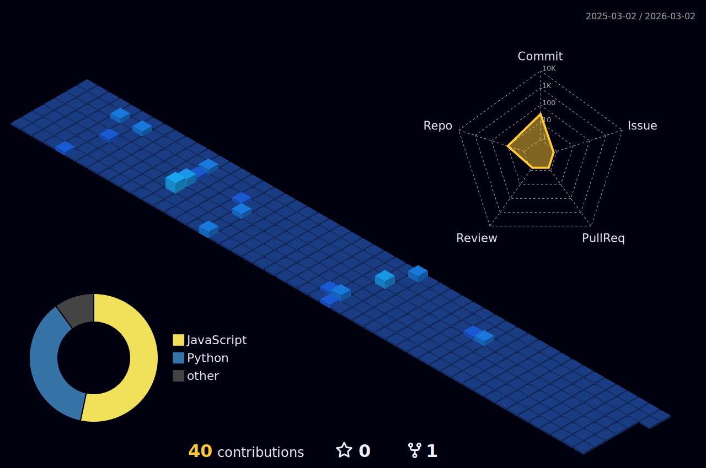

<!--
    Portfolio README.md
    Purpose: Showcase GitHub profile with dynamic stats, skills, and social presence
    Sections:
    1. Header & Introduction
    2. Social Links
    3. Skills & Technologies
    4. GitHub Stats & Activity
    5. Projects Showcase
    6. Blog Posts
    7. Fun Elements
    8. Footer
-->

<!-- HEADER: BANNER -->

<!-- INTRO: NAME -->

<!-- SOCIAL LINKS -->

<!-- PROFILE SUMMARY -->

Building AI/ML-driven experiences with a creative edge in design and code 🤖

Passionate about learning deeply and creating magic in both code and cuisine 🧑🏻‍🍳

Curiosity fuels my journey; wanderlust shapes my perspective 👨🏻‍🎨

Always up for a challenge — creative, technical, or just plain fun 🐼

<!-- BLOG POSTS SECTION -->
#### 📝 Recent Writings [Read more...](https://kanishkvarshney.medium.com)

<!-- BLOG-POST-LIST:START -->
[Python Is Fun: Tricks of the Trade](https://kanishkvarshney.medium.com/fun-with-python-88d599ac07e1?source=rss-f03eab685dc5------2) 
[Python Documentation: Generating HTML using Sphinx](https://kanishkvarshney.medium.com/python-documentation-generating-html-using-sphinx-a0d909f5e963?source=rss-f03eab685dc5------2) 
[Python Documentation: Getting Started](https://kanishkvarshney.medium.com/python-documentation-getting-started-141f077b1b92?source=rss-f03eab685dc5------2) 
[Hosting your Flask Web Application on GoDaddy](https://kanishkvarshney.medium.com/hosting-your-flask-web-application-on-godaddy-5628a60e7151?source=rss-f03eab685dc5------2) 
<!-- BLOG-POST-LIST:END -->

<!-- SKILLS SECTION -->

### 💻 Tech Stack

  
  
  
  
  
  
  
  
  
  
  

<!-- GITHUB STATS SECTION -->
## 📊 GitHub Stats

  

  
  

  

<!-- FEATURED PROJECTS SECTION -->
## 📁 Featured Projects

  <table>
    <tr>
      <td>
        
      </td>
      <td>
        
      </td>
    </tr>
    <tr>
      <td>
        
      </td>
      <td>
        
      </td>
    </tr>
  </table>

 

<!-- FUN ELEMENTS SECTION -->

 

<!-- FOOTER -->

